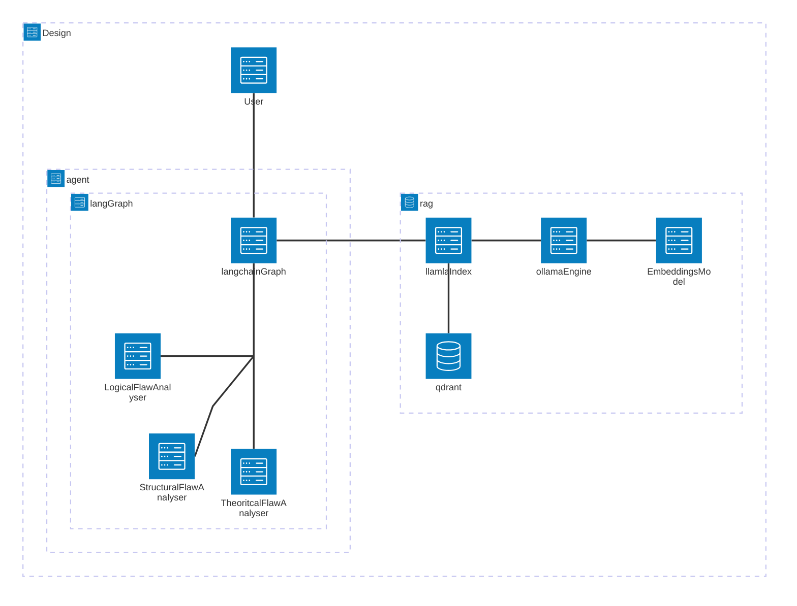

# [TDD v1]:  Failure Analysis Agentic Tool:
## Description:
This is an Agentic AI tool designed to catch structural, logical and theoritical and hythotheical flaws that lead experimental and production implementation failures. This is desinged to be used by Reseachers, Engineers in subject matter domains where concise expert knowldge is required to resolve technical and structural flaws leading to  implemention failures.
### Problem Definition and Constriants:
This project is specificslly aimed at catching structural, logical and theoritical flaws in an R&D Design and implementation stage. **!!! This is not a code debugger(although it has inherent capbalities to identify implementaion logic flaws) or code Implementer**   
**Strucrureal flaw**: This is an inherent systemic weakness in the arrangements and or composition of system.largely anchored to design philosophy and design orchestration flow errors  
**Logical flaw**: This is an weakness in the reasoning process itself through flawed connections between arguments (premises) and the conclusion. Largely anchored technical implementation error. 
**Theoritical flaw**: This is a weekness in the underlying hypothesis, belief, or data upon which a plan is based. It is a flaw in the idea rather than the structure.

1. #### Input: 
    1. Prompt, 
    2. Research Documentation or Implementation Design Documentation 
2. #### Output: 
    1. Resposne: logical,structural,thoeritcal flaw findings, 
    2. Suggested Recommendation

### Process Workflow:
##### Architecure Design: 

